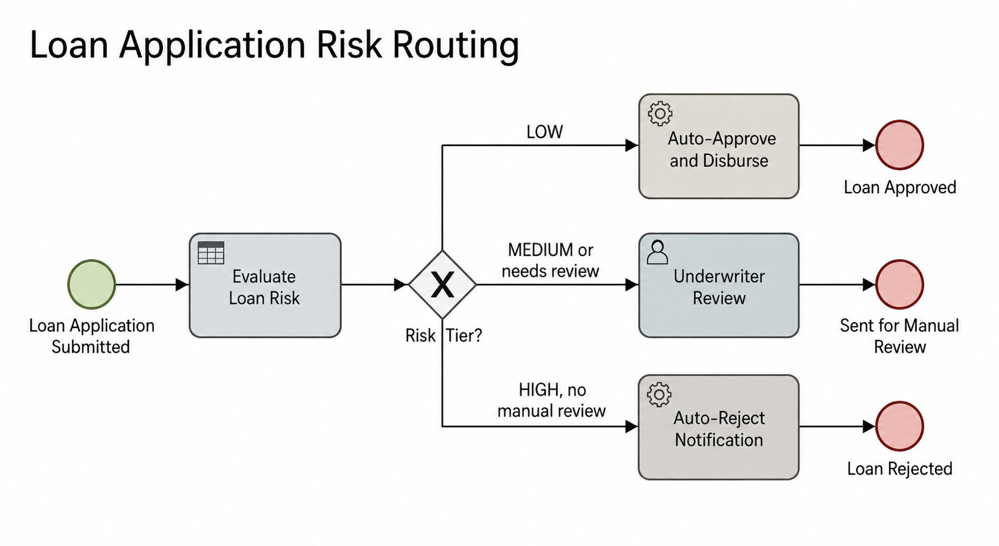
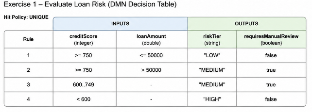
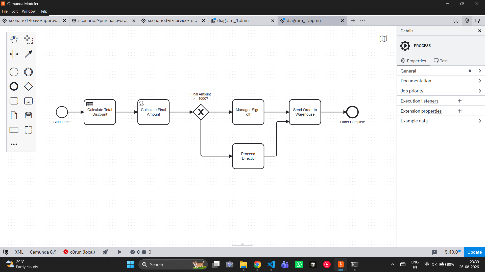
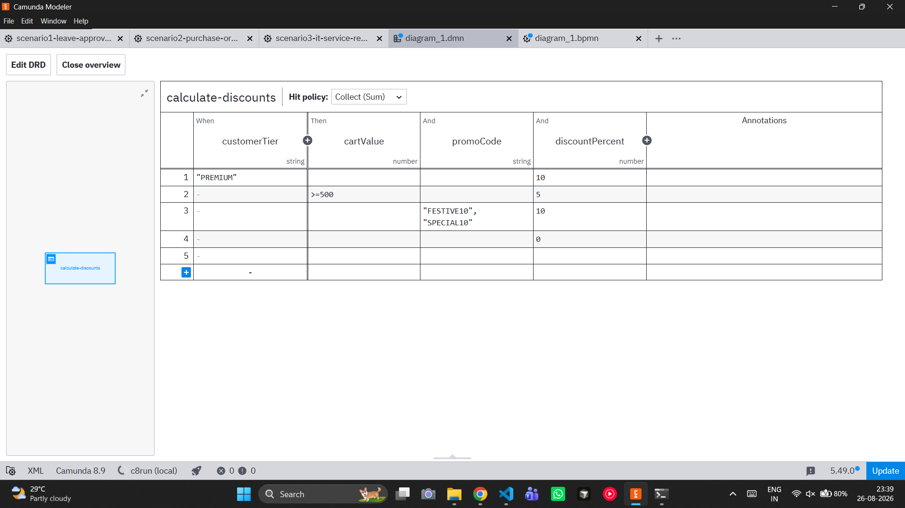

YES 😭 **You mean a complete raw Markdown file that you can copy-paste directly into `README.md`.** No extra explanation, no weird nested formatting.

````markdown
# Workflow Assignment 2

This repository contains the BPMN and DMN workflow implementations for the assigned workflow automation exercises using **Camunda Modeler**.

## Repository Structure

```text
Workflow-Assignment-2/
│
├── Exercise-1/
│   ├── ex1-loan-risk-routing.bpmn
│   ├── ex1-evaluate-loan-risk.dmn
│   └── ex1-loan-risk-routing.png
│
├── Exercise-2/
│   ├── ex2-order-discount-fulfillment.bpmn
│   ├── ex2-calculate-discounts.dmn
│   ├── ex2-order-discount-fulfillment.png
│   └── ex2-calculate-discounts.png
│
└── README.md
````

---

# Exercise 1 — Loan Application Risk Routing

## Objective

This workflow automates the routing of loan applications based on a risk assessment performed using a **DMN decision table**.

The process evaluates the applicant's **credit score** and **loan amount**, determines the corresponding risk tier, and routes the application accordingly.

## BPMN Process

The BPMN process consists of:

* **Start Event** — Loan Application Submitted
* **Business Rule Task** — Evaluate Loan Risk
* **Exclusive Gateway (XOR)** — Risk Tier?
* **Service Task** — Auto-Approve and Disburse
* **User Task** — Underwriter Review
* **Service Task** — Auto-Reject Notification
* **End Events** — Approval, Manual Review, and Rejection

## Process Flow

```text
Loan Application Submitted
          |
          v
   Evaluate Loan Risk
          |
          v
       Risk Tier?
      /     |     \
     /      |      \
   LOW    MEDIUM    HIGH
    |        |        |
    v        v        v
Auto-     Underwriter  Auto-
Approve     Review     Reject
    |        |        |
    v        v        v
 Approved  Manual    Rejected
           Review
```

## DMN Decision Table

The `evaluate-loan-risk` decision evaluates:

### Inputs

* `creditScore`
* `loanAmount`

### Outputs

* `riskTier`
* `requiresManualReview`

### Decision Rules

| Rule | Credit Score | Loan Amount | Risk Tier | Requires Manual Review  |
|------|--------------|-------------|-----------|-------------------------|
| 1    | >= 750       | <= 50000    | LOW       | false                   |
| 2    | >= 750       | > 50000     | MEDIUM    | true                    |
| 3    | 600–749      | Any         | MEDIUM    | true                    |
| 4    | < 600        | Any         | HIGH      | false                   |

The DMN uses the **UNIQUE** hit policy so that one rule matches each loan application.

## Decision Logic

* Applicants with a credit score of **750 or higher** and a loan amount of **50000 or less** are classified as **LOW risk**.
* Applicants with a credit score of **750 or higher** and a loan amount above **50000** are classified as **MEDIUM risk** and require manual review.
* Applicants with a credit score between **600 and 749** are classified as **MEDIUM risk** and require manual review.
* Applicants with a credit score below **600** are classified as **HIGH risk** and are automatically rejected.

### Exercise 1 BPMN Diagram



### Exercise 1 DMN Diagram



---

# Exercise 2 — Multi-Item Order Discount and Fulfillment

## Objective

This workflow calculates an order discount using a **DMN decision table**, calculates the final order amount, and determines whether managerial sign-off is required before the order is sent to the warehouse.

## BPMN Process

The process consists of:

* **Start Event** — Start Order
* **Business Rule Task** — Calculate Total Discount
* **Script Task** — Calculate Final Amount
* **Exclusive Gateway (XOR)** — Final Amount >= 1000?
* **User Task** — Manager Sign-off
* **Proceed Directly**
* **Service Task** — Send Order to Warehouse
* **End Event** — Order Complete

## Process Flow

```text
      Start Order
         |
         v
  Calculate Total Discount
         |
         v
  Calculate Final Amount
         |
         v
 Final Amount >= 1000?
      /        \
    YES         NO
     |           |
     v           v
Manager      Proceed
Sign-off     Directly
     |           |
      \         /
       \       /
        v     v
   Send Order to
     Warehouse
         |
         v
   Order Complete
```

## DMN Decision — Calculate Discounts

The `calculate-discounts` decision determines the applicable discount based on:

* `customerTier`
* `cartValue`
* `promoCode`

### DMN Decision Table

| Rule | Customer Tier | Cart Value | Promo Code           | Discount |
| ---- | ------------- | ---------- | -------------------- | -------- |
| 1    | PREMIUM       | —          | —                    | 10       |
| 2    | —             | >= 500     | —                    | 5        |
| 3    | —             | —          | FESTIVE10, SPECIAL10 | 10       |
| 4    | —             | —          | —                    | 0        |

The DMN uses the **Collect (Sum)** hit policy so that multiple applicable discount rules can be collected and summed.

## Business Rule Task

The **Calculate Total Discount** Business Rule Task invokes:

```text
calculate-discounts
```

The resulting decision value is stored in:

```text
totalDiscount
```

## Script Task

The **Calculate Final Amount** Script Task calculates the final order amount using:

```text
finalAmount = cartValue * (1 - (totalDiscount / 100))
```

The resulting value is stored in:

```text
finalAmount
```

## Gateway Conditions

The XOR gateway routes the process based on the calculated `finalAmount`.

### Manager Sign-off

```text
finalAmount >= 1000
```

If the final amount is greater than or equal to 1000, the order proceeds to **Manager Sign-off**.

### Proceed Directly

```text
finalAmount < 1000
```

If the final amount is below 1000, the order proceeds directly without manager approval.

Both branches eventually continue to:

```text
Send Order to Warehouse
```

and then:

```text
Order Complete
```

## Test Case

The workflow can be tested with:

```text
customerTier = PREMIUM
cartValue = 600
promoCode = FESTIVE10
```

Applicable discounts:

```text
Premium customer = 10%
Cart value >= 500 = 5%
FESTIVE10 = 10%

Total Discount = 25%
```

Final amount:

```text
600 × (1 - 25 / 100) = 450
```

Since:

```text
450 < 1000
```

the order follows:

```text
Proceed Directly
        ↓
Send Order to Warehouse
        ↓
Order Complete
```

### Exercise 2 BPMN Diagram



### Exercise 2 DMN Diagram



---

# Technologies Used

* **Camunda Modeler 8.9**
* **BPMN 2.0**
* **DMN**
* **FEEL**
* **Script Tasks**
* **Business Rule Tasks**
* **Exclusive Gateways**

---

# Key Concepts Demonstrated

## BPMN

The workflows demonstrate:

* Start Events
* End Events
* Business Rule Tasks
* Script Tasks
* User Tasks
* Service Tasks
* Exclusive Gateways
* Conditional Sequence Flows

## DMN

The decision tables demonstrate:

* Input clauses
* Output clauses
* Hit Policies
* FEEL expressions
* Business Rules
* Decision Result Mapping

## BPMN and DMN Integration

The assignment demonstrates the separation of:

```text
BPMN
  |
  | Defines the process flow
  v
Business Process
```

and:

```text
DMN
  |
  | Defines the business decision logic
  v
Business Decision
```

This allows business rules to be maintained separately from the workflow orchestration.

---

# Summary

This assignment demonstrates the use of **BPMN and DMN with Camunda Modeler** to implement workflow orchestration and business decision logic.

The two implemented workflows are:

1. **Loan Application Risk Routing**
2. **Multi-Item Order Discount and Fulfillment**

The workflows use BPMN for process orchestration and DMN for decision-making, with gateways and task types used to route and execute the appropriate workflow paths.

